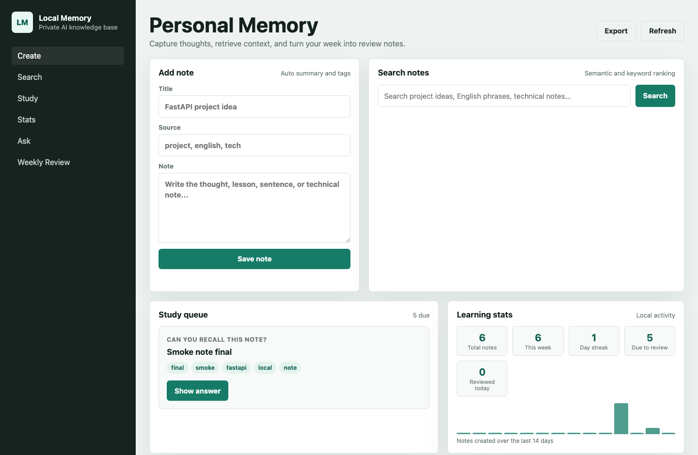

# Local Memory

Local Memory is a local-first AI personal knowledge base. It stores notes in
SQLite, creates local embeddings for retrieval, and uses Ollama on your own
machine for summaries, tags, question answering, and weekly reviews.

## What It Does

- Create, edit, and delete notes for ideas, projects, English sentences, and technical notes.
- Organize notes and source files by course and term.
- Import Markdown, TXT, PDF, DOCX, PPTX, and common image files into a managed local library.
- Automatically summarize and tag notes (regenerated on every edit).
- Review approved cards with a spaced-repetition queue (simplified SM-2, like Anki).
- Export cited course Study Packs for ChatGPT and import reviewed Markdown results.
- Track learning stats: day streak, notes per week, due reviews, 14-day activity.
- Search notes and document chunks together with local semantic embeddings plus keyword matching.
- Filter notes and search results by tag.
- View a note's full detail alongside its most similar notes, with Markdown rendering.
- Ask questions over notes and course files with file, page, slide, paragraph, or heading citations.
- Generate weekly reviews from local notes.
- Export all notes as a single Markdown file for backup.
- Keyboard shortcuts: `/` search, `n` new note, `Esc` close dialog.
- Keep all note data, embeddings, summaries, and reviews on your computer.

## Screenshots



Responsive layout on a phone-sized window: [dashboard-mobile.png](docs/screenshots/dashboard-mobile.png)

## Demo Walkthrough

1. **Capture** — create a course, import existing study files, or press `n` and type a thought (Markdown supported), then hit
   *Save note*. A one-sentence summary and topic tags are generated
   automatically (Ollama when available, local fallback otherwise).
2. **Study** — new notes and document chunks enter the candidate inbox. Edit,
   approve, or reject them; only approved cards enter the queue. Reveal the
   answer, then grade yourself *Again / Good / Easy*.
3. **Track** — the stats panel shows your day streak, due reviews, and a
   14-day activity chart.
4. **Retrieve** — press `/` and search in English or Chinese (CJK bigram
   matching), filter by course or tag, and follow the file and location shown
   on document results.
5. **Ask** — question your own notes in natural language and get a cited,
   Markdown-formatted answer.
6. **Reflect** — generate a weekly review with themes, ideas to revisit,
   and next actions; export everything to Markdown any time.

## Architecture

- `FastAPI` backend, bound to `127.0.0.1` by default.
- `SQLite` database under `./data/memory.db` by default.
- Managed originals under `./data/library` by default, with SHA-256 duplicate detection.
- Local embedding provider with deterministic hashing by default.
- Optional stronger local embeddings through `sentence-transformers`.
- `Ollama` local LLM integration at `http://127.0.0.1:11434`.
- Plain HTML/CSS/JS web UI that can later be wrapped by Tauri or Electron.

No cloud server is required. The app is designed to run as a local backend
process today and be packaged as a desktop app later.

## Quick Start

```bash
python3 -m venv .venv
source .venv/bin/activate
pip install -r requirements.txt
uvicorn app.main:app --host 127.0.0.1 --port 8000 --reload
```

Open:

```text
http://127.0.0.1:8000
```

On macOS you can also double-click `Local Memory.command` in Finder to
start the server and open the app in one step.

## Ollama Setup

Install Ollama and pull a local model:

```bash
ollama pull qwen2.5
ollama serve
```

The app defaults to:

```text
OLLAMA_BASE_URL=http://127.0.0.1:11434
OLLAMA_MODEL=qwen2.5
```

If Ollama is not running, notes still save and search still works. Summaries,
tags, and answers fall back to a simple local offline mode until Ollama is
available.

## Configuration

Copy `.env.example` to `.env` or export variables in your shell:

```bash
export MEMORY_DB_PATH=./data/memory.db
export MEMORY_LIBRARY_DIR=./data/library
export MEMORY_MAX_UPLOAD_MB=100
export MEMORY_AI_MODE=auto
export OLLAMA_MODEL=qwen2.5
```

`MEMORY_AI_MODE` values:

- `auto`: try Ollama, fall back locally if it is unavailable.
- `offline`: never call Ollama.
- `ollama`: prefer Ollama; still fails gracefully if the service is down.

`MEMORY_EMBEDDING_BACKEND` values (default `auto`):

- `auto`: use sentence-transformers when installed, otherwise hash.
- `hash`: deterministic local embeddings with CJK bigrams, no model download.
- `sentence-transformers`: require a local sentence-transformers model.

For stronger semantic search, just install the package and restart —
stored vectors are versioned and rebuilt automatically on startup:

```bash
pip install sentence-transformers
```

You can also switch the Ollama model from the sidebar dropdown; the choice
is persisted in SQLite and survives restarts.

## Course Library

Create a course in the **Course library** panel, then select one or more files
to import. Each original is copied into `MEMORY_LIBRARY_DIR`; moving or deleting
the source file later does not break the local library. The default maximum is
100 MB per file and can be changed with `MEMORY_MAX_UPLOAD_MB`.

Supported inputs:

| Format | Indexed location |
| --- | --- |
| Markdown | Heading |
| TXT | Text document |
| PDF | Page number |
| DOCX | Paragraph and heading |
| PPTX | Slide number and title |
| PNG, JPEG, WebP | Stored as `ocr_required` until local OCR is added |

Identical file content is detected by SHA-256 and returns the existing library
record instead of storing another copy. A damaged document remains in the
library with `failed` status and a readable error; use **Retry** after replacing
or repairing the parser environment. Search and Ask can be limited to one
course, and document sources include the original filename plus their heading,
page, paragraph, or slide label.

## Review Cards And ChatGPT

Study cards are independent from notes. Existing review history is migrated to
active cards on first startup after the upgrade. New notes and indexed document
chunks create `candidate` cards only; each candidate must be edited/approved or
rejected before it can enter spaced repetition. Active cards can also be
suspended without deleting their source note or document.

For ChatGPT Study Mode or a ChatGPT Project:

1. Select a course under **ChatGPT Study Pack** and download its Markdown pack.
2. Upload that file to ChatGPT. It contains local notes, document excerpts,
   citations, current cards, and reusable project instructions.
3. Review ChatGPT's result and keep it in this structure:

```markdown
# Local Memory Study Result
## Reviewed Note
Title: Example
Source: lecture.pdf · page 2
### Content
Reviewed content
## Card Candidate
Prompt: Question
Source: lecture.pdf · page 2
### Answer
Answer text
```

4. Import the reviewed `.md` file. Notes are saved locally and all imported
   cards remain candidates until approved.

This bridge does not use an OpenAI API key and never uploads automatically.

## Tests

```bash
python -m pytest -q
```

The service tests use fake AI clients and do not require Ollama.

## Desktop App

Two ways to run Local Memory like a desktop app today:

- **Native window** (WKWebView via pywebview, no browser chrome):

  ```bash
  pip install pywebview
  python3 desktop.py
  ```

- **One-click launcher**: double-click `Local Memory.command` in Finder to
  start the server and open the app in your browser.

The architecture also stays ready for a Tauri shell (requires the Rust
toolchain): the backend binds only to `127.0.0.1`, storage paths are
configurable (`MEMORY_DB_PATH` can point at
`~/Library/Application Support/Local Memory/memory.db`), and the UI talks
to stable local HTTP APIs.

Resume line:

```text
Built a local-first AI personal memory app with FastAPI, SQLite, semantic search, Ollama-powered summarization, and a desktop-ready architecture.
```
